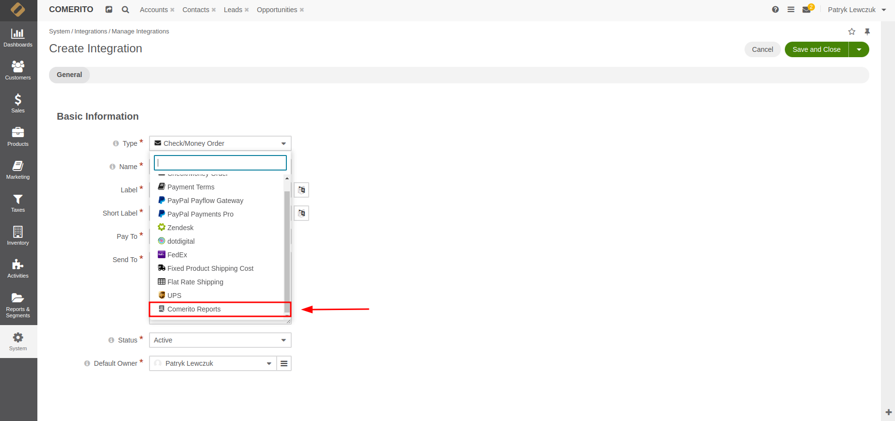

# orocommerce-report-plugin
This extension provides six predefined, highly useful reports to help you gain deeper insights into your sales and customers.

## Requirements

| | Version       |
| :--- |:--------------|
| PHP  | 8.2, 8.3, 8.4 |
| OroCommerce | 5.1, 6.0 |

## Installation

### Step 1: Require the Plugin using composer

Run the following Composer command to add the plugin as a dependency:

```bash
  composer require comerito/orocommerce-report-plugin
```

### Step 2: Clear Cache

Clear the cache to ensure entity data are properly loaded:

```bash
  php bin/console cache:clear
```

### Step 3: Enable the Plugin

Run the following command to enable the plugin in OroCommerce:

```bash
  php bin/console oro:platform:update --force
```

### Step 4: Clear Cache

Clear the cache to ensure the changes take effect:

```bash
  php bin/console cache:clear
```
## Usage

### Step 1: Create integration

After installation process, you will be able to create Comerito Report Integration.

To do so, you need to navigate in your OroCommerce backoffice panel to System >> Integration >> Manage Integrations.

Click to 'Create Integration' button.


Select 'Comerito Report' integration.



Fill out required information. In this step you can choose for which business unit report will be available.


Click Save and Close button. After this action on integrations list you should see Comerito Reports in Inactive status.


### Step 2: Activation

You are 2 clicks from using new reports 😁. Now all you need to do is click on 3 dots (right side of integrations list page) and select activation icon.


Now all you need to do is to refresh site. In your 'Reports & Segment' section you will see 6 brand-new reports created for you.

Fill free to edit it any way you want.

### Any Questions?

If you have any questions please see a [FAQ](https://comerito.com/report-extension/#FAQ)

## How to use GrumPHP

* GrumPHP official documentation [Documentation](https://github.com/phpro/grumphp/blob/v2.x/README.md)
* See useful site with command and detailed installation handbook [GrumPHP Command](https://github.com/phpro/grumphp/blob/v2.x/doc/commands.md)

## Contributing

* See [How to contribute](CONTRIBUTING.md)

## License

This library is under the [EUPL-1.2 licence](LICENCE).
